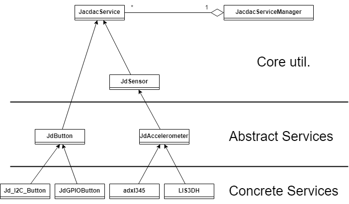

# Jacdac++

## What is Jacdac++?
Jacdac++ is a C++ replacement of the [Jacdac-c](https://github.com/microsoft/jacdac-c) service implementation for the [Jacdac](https://microsoft.github.io/jacdac-docs/) protocol
with the intention to make life easier for people who wish to make a Jacdac device. It does this by abstracting away much of the original c code in a c++ wrapper
and taking advantage of the object-oriented nature of c++ to provide simpler and less error-prone endpoints for the user.

Obviously, reimplemening services means a lot of Jacdac-c code is reused. All credit for those code snippets belong to the original authors over at https://github.com/microsoft/jacdac-c.

## Installation
Simply copy the files into your project and include JacdacServiceManager.h to get access to the JacdacServiceManager global.
As Jacdac++ only replaces the Jacdac-c service implementation you still need to include Jacdac-c for the rest of the protocol implementation.

### Jacdac++ Architecture

## Examples

The next few subsections will show how Jacdac++ changes the workflow of creating a service module using a few basic examples.
### Existing Concrete Implementation

If a service already exists for the component you want to use then usage is simple, the examples below show the original Jacdac method for creating a module with a single button and a red led and the Jacdac++ method respectively. As you can see the construction has been greatly simplified and default values are provided for optional parameters. In the original Jacdac you needed to define the function `app_init_services()` such that all services are initialized when that function is invoked. Services are initialized by invoking an init function with the required arguments. In Jacdac++ that method is replaced by a global service manager which will initialize all services added to it. The services themselves also are less complicated to initialize since arguments with a default value can now be omitted.

Jacdac 

    void app_init_services() {
    led_params_t params = {
    .pin_r = LED_RED,
    .mult_r = 255,
    .pin_g = 0xff,
    .mult_g = 255,
    .pin_b = 0xff,
    .mult_b = 255,
    .active_high = 0,
    .pwm_period = 512,
    };
    led_service_init(&params);
    
        //0xff == NO_PIN
          button_init(D1, false, 0xff);
    }

Jacdac++

    JacdacServiceManager.addService(new JdGPIOLedSingle(LED_RED));
    JacdacServiceManager.addService(new JdGPIOButton(D1));

### Existing Abstract Implementation
For components that are more varied in how they are controlled, for example an I2C accelerometer whose readings are stored in several registers, you will likely not be able to use an existing implementation. For the next example I will show how someone would connect an accelerometer for which there does not exist a concrete service yet but there does already exist the abstract accelerometer service.

Jacdac 

    static void adxl345_init(void) {
        /* implementation */
        }
    static void *adxl345_get_sample(void) {
        /* implementation */
        }
    
    const accelerometer_api_t accelerometer_adxl345 = {
        .init = adxl345_init,
        .get_reading = adxl345_get_sample,
    };
    
    void app_init_services() {
        accelerometer_init(&accelerometer_adxl345);
    }

Jacdac++ (adxl345.h)

    #include "../JdAccelerometer.h"
    class adxl345 : public JdAccelerometer {
    public:
        explicit adxl345(uint8_t address){
            /* implementation */
            }
    
    protected:
        const jd_accelerometer_forces_t accelerometer_get_reading() override {
            /* implementation */
            }
    
    private:
        uint8_t address_;
    };

Jacdac++ (main.cpp)

    JacdacServiceManager.addService(new adxl345(0x53));

Here the improvements are less immediately obvious. Jacdac often uses function pointer parameters for services that are expected to differ a lot in implementation whereas Jacdac++ offers a similar versatility by providing virtual functions that may be overridden by derived classes. Where Jacdac++ differs is in that it provides that versatility with every service, if perhaps you happen to want to use a button that doesn't use GPIO. Additionally, most function pointer parameters for reading a sensor in Jacdac return a void pointer, due to these deriving directly from the generic sensor processing functions. In Jacdac++ these functions properly return an actual type, which prevents errors and clearly communicates what the function is expected to return. The use of actual classes instead of function pointers also allows for further inheritance. For example, instead of adxl345 directly inheriting from JdAccelerometer, you could create a generic I2C accelerometer class that could then be inherited from by adxl345 and other I2C accelerometers.

### New Jacdac++ Service
Creating a service from scratch has been greatly simplified, as the example below shows. Variables usually held in a state struct have been moved to the class. Registers, which used to be defined by several macros that would link the nth defined register to the nth variable in the state struct, are now created with a simple function call to link it to a variable. All of the macros and other required boilerplate code has been removed, simply inherit from JacdacService or JdSensor and implement the needed functions.

Jacdac 

    struct srv_state {
        SENSOR_COMMON;
        int myregistervariable_;
        };
    
    REG_DEFINITION(               //
        myservice_regs,           //
        REG_SENSOR_COMMON,        //
        REG_U8(JD_REG_MYREGISTER), //
        )
    void myservice_process(srv_t *state) {
        /* implementation */
        }
    
    void myservice_handle_packet(srv_t *state, jd_packet_t *pkt) {
        /* implementation */
        }
    
    SRV_DEF(myservice, JD_SERVICE_CLASS_MYSERVICE);
    void myservice_init() {
        SRV_ALLOC(myservice);
        /* implementation */
        }

Jacdac++ 

    class JdMyService : public JdSensor {
    public:
        explicit JdMyService(){
            addRegister(JD_REG_MYREGISTER, myregistervariable_);
            /* implementation */
            }
        void process() override {
            /* implementation */
            }
        void handle_packet(jd_packet_t *pkt) override{
            /* implementation */
            }
        
        uint32_t getServiceClass() override {
            return JD_SERVICE_CLASS_MYSERVICE;
        }
    private:
        int myregistervariable_;
    };

### Existing Jacdac Service Implementation
Jacdac++ still allows you to use the original Jacdac service functions by providing a JacdacServiceManager.addService() overload that accepts function pointers.

    JacdacServiceManager.addService({
        button_init(D1, false, 0xff);
        }
    );

But obviously that method prevents you from taking advantage of most of Jacdac++'s changes. A script (convert.py) is provided alongside Jacdac++ which will attempt to convert an existing Jacdac service into a Jacdac++ service. It will not be able to fully convert the service and minor tweaks will be needed to make the service compile. All errors caused by the script will be pointed out by any ide that provides syntax checking. Unfortunately the resulting service will not be split into an abstract service and a concrete implementation. This is because those changes require understanding of the actual implementation specific to that service that cannot be coded into a simple script.

## Core API

### JacdacServiceManager
 This class is provided as a global variable and only has one function, \verb|addService()|, which accepts a JacdacService object. All added services will be initialized when Jacdac starts on the device. \verb|addService()| also accepts function pointers which allows Jacdac-c style service initialization functions to be added. \newline

### JacdacService
 This class is an abstract base class from which all Jacdac++ services inherit. It provides three virtual functions that any subclass is required to implement: process(), handle_packet(jd_packet_t *pkt), and getServiceClass().

     process() is invoked regularly and should contain any processing a service must do.
     handle_packet(jd_packet_t *pkt) is invoked when the service receives a Jacdac packet.
     getServiceClass() should return the identifier of the service this class represents.

Additionally it exposes a few helper functions to derived classes to handle registers:
   
     addRegister(int regCode, T& reg) connects a register to a member variable of the class
     service_handle_register(jd_packet_t *pkt) handles packets that read/write registers.
     service_handle_register_final(jd_packet_t *pkt) does the same but but calls jd_send_not_implemented() for unknown packets.

Registers are how Jacdac services expose variables.

#### handle_packet(jd_packet_t *pkt)
your service needs to know what to do when it receives a packet, in most cases you can simply send it along to service_handle_register() or sensor_handle_packet() and their equivalents. If however your service needs to respond differently to certain commands you can do that here.
Check the service command value to discriminate between package types. [JdLedSingle](src/services/JdLedSingle.cpp) has a good example of packet handling.
### JdSensor
 This class derives from JacdacService and implements a large amount of utility functions for sensor services. Most of the utility functions are direct copies of Jacdac-c functions with the now unneeded state argument removed. JdSensor also provides a small list of virtual functions that a sensor may implement:

     sensor_init()
     sensor_process()
     sensor_sleep()
     sensor_get_range()
     sensor_set_range(int32_t range)
     generic_sensor_get_reading()

These functions are not required and if not implemented by a derived class will simply result in a no-op. generic_sensor_get_reading() returns a void pointer and should be implemented as the void cast of a get_reading() function that does have a proper return type.
